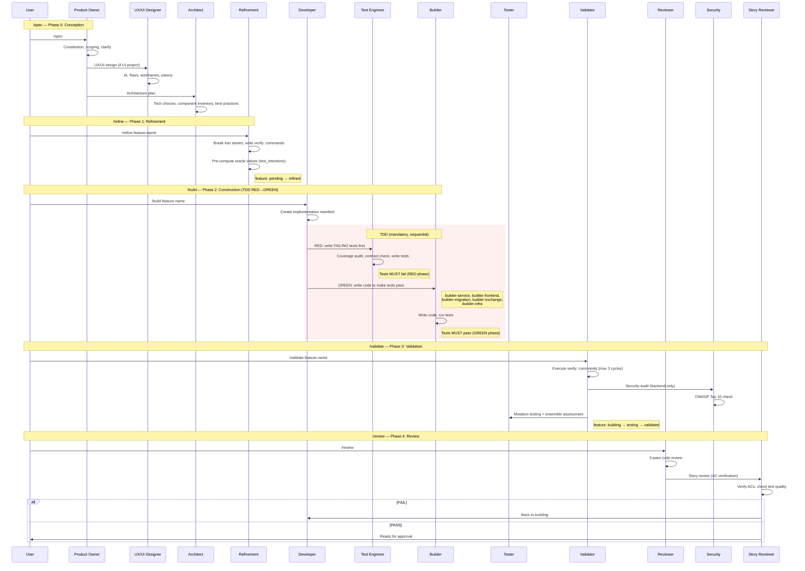

[< Back to Index](INDEX.md)

# Dev Agents

19 agents in agents/. Each agent has a core file (agent-name.md) and a reference template file (agent-name.ref.md). The core file contains role, rules, and process. The ref file contains examples, templates, and lookup tables loaded on demand.

---

## Agent Catalog

### Orchestration & Conception

| Agent | File | Model | Role |
|-------|------|-------|------|
| Orchestrator | orchestrator.md | Opus | Coordination rules enforced by skills -- not loaded directly. Documents workflow, phase guards, feature tracker states. |
| Product Owner | product-owner.md | Opus | Scoping, spec writing, AC format, constitution. Challenges assumptions and proposes MVP scope. |
| UX/UI Designer | ux-ui.md | Sonnet | UX/UI design: information architecture, user flows, design tokens, wireframes. WCAG 2.1 AA compliance. |
| Architect | architect.md | Opus | Architecture decisions, implementation manifest, shared component inventory, interactive best practices proposal. |

### Refinement & Spec

| Agent | File | Model | Role |
|-------|------|-------|------|
| Refinement | refinement.md | Opus | Feature breakdown into stories with verify: commands, UX gate, ADR gate, component reuse audit, test_intentions with oracle values. |
| Spec Generator | spec-generator.md | Sonnet | Merges YAML spec overlays into readable markdown. Regenerates docs from YAML source. |

### Build

| Agent | File | Model | Role |
|-------|------|-------|------|
| Developer | developer.md | Opus | Senior developer -- implements code following architecture plan. Manifest-scoped, component reuse check, stale detection. |
| Builder: Service | builder-service.md | Sonnet | Backend services: models, routers, schemas, business logic, tests. |
| Builder: Frontend | builder-frontend.md | Sonnet | React/frontend: pages, components, hooks, API client, tests. Reads UX working files. |
| Builder: Infrastructure | builder-infra.md | Sonnet | Docker, docker-compose, CI/CD, nginx, deployment config. |
| Builder: Migration | builder-migration.md | Sonnet | Database migrations: create, conflict resolution, squash, schema alignment + roundtrip tests. |
| Builder: Exchange | builder-exchange.md | Opus | Exchange/trading adapter: CCXT, order placement, paper/live mode, reconciliation. Safety-critical. |

### Quality & Testing

| Agent | File | Model | Role |
|-------|------|-------|------|
| Test Engineer | test-engineer.md | Opus | TDD RED phase: writes failing tests from spec before builder writes code. Coverage audit, contract checking, test_intentions enforcement. |
| Tester | tester.md | Opus | Test writing: batch sizing, kill-tests for mutation survivors, ensemble assessment (STRONG/WEAK/USELESS), LLM fault scenarios. |
| Validator | validator.md | Sonnet | Independent AC verification: executes verify: commands from build contract, spec contract check, forbidden pattern scanning. Max 3 cycles. |
| Reviewer | reviewer.md | Sonnet | 3-pass code review: KISS/SOLID/DRY/YAGNI, static analysis (automated hook), safety/OWASP/API design. Manifest scope enforcement. |
| Story Reviewer | story-reviewer.md | Sonnet | Verifies each AC against committed code, checks test quality and write-path coverage, posts PASS/FAIL verdict. |
| Security | security.md | Opus | Security audit: per-story (backend only), per-service, pre-go-live. OWASP Top 10 aligned. CRITICAL/HIGH blocks story. |

### Operations

| Agent | File | Model | Role |
|-------|------|-------|------|
| DevOps | devops.md | Sonnet | CI/CD and deployment pipelines, environment config, release management. |

---

## File Naming Convention

All agent files use **kebab-case**:
- Core: `agent-name.md` -- role, rules, process
- Reference: `agent-name.ref.md` -- templates, examples, lookup tables (loaded on demand)

This split reduces token usage by ~60% per session. The core file is always loaded; the ref file is loaded only when the agent needs specific templates or examples.

---

## Build Lifecycle

---

## Quality Gates

Every feature passes through these gates. None can be skipped.

| Gate | Phase | Agent | Enforcement | Failure action |
|------|-------|-------|-------------|----------------|
| TDD RED | /build | Test Engineer | check_red_phase.py | Pipeline stops |
| RED: intentions | /build | Developer | check_test_intentions.py | Pipeline stops |
| RED: coverage | /build | Developer | check_coverage_audit.py | Pipeline stops |
| RED: MSW | /build | Developer | check_msw_contracts.py | Pipeline stops |
| TDD GREEN | /build | Builder | check_test_tampering.py | Pipeline stops |
| GREEN: order | /build | Developer | check_tdd_order.py | Pipeline stops |
| Code review | /validate | Reviewer | 3-pass review | Builder fixes findings |
| Security audit | /validate | Security | OWASP checklist | CRITICAL/HIGH blocks |
| AC validation | /validate | Validator | verify: commands | Max 3 cycles, then escalate |
| Story review | /review | Story Reviewer | AC vs code check | Feature back to building |
| Human approval | -- | User (human) | Manual | Only humans mark Done |

**TDD gates are machine-enforced.** Enforcement scripts live in `scripts/`. Agents cannot self-certify -- only the script exit code is trusted.

---

## Which Skill Loads Which Agent

| Skill | Primary agent(s) | Builder agents (dispatched) | Quality agents (auto) |
|-------|-------------------|---------------------------|----------------------|
| /spec | product-owner, ux-ui, architect | -- | -- |
| /refine | refinement | -- | -- |
| /build | developer | builder-service, builder-frontend, builder-infra, builder-migration, builder-exchange | test-engineer, tester |
| /validate | validator | -- | security, reviewer |
| /review | story-reviewer | -- | -- |
| /ux | ux-ui | -- | -- |
| /scan | -- (script) | -- | -- |
| /scan-full | -- (script) | -- | -- |
| /sonar | -- (script) | -- | -- |
| /migrate | -- (script) | -- | -- |
