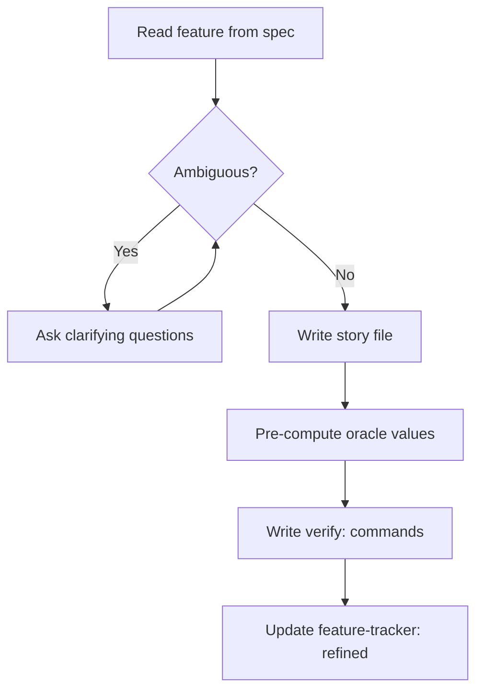
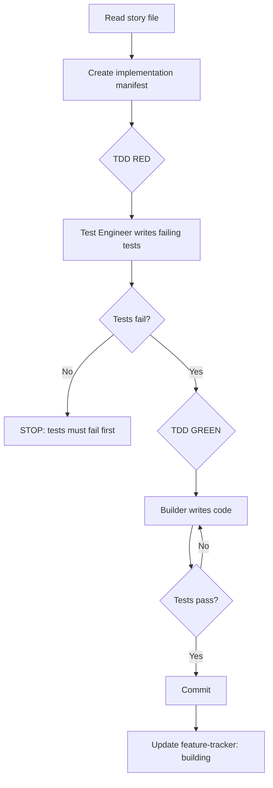
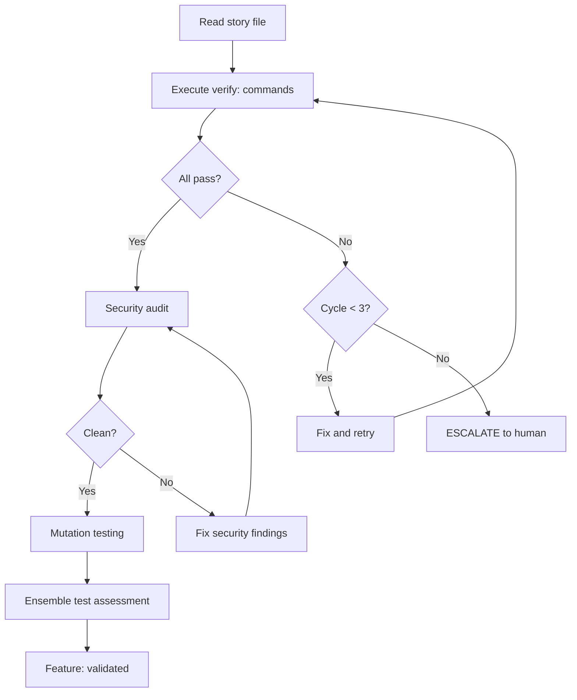
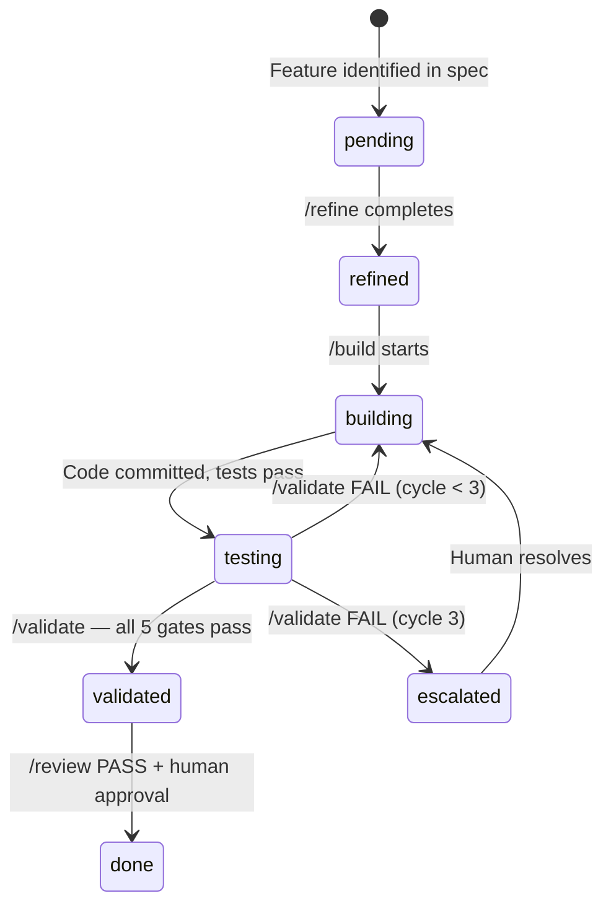
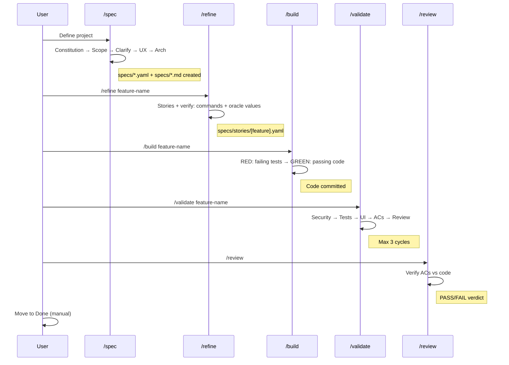

[< Back to Index](INDEX.md)

# Working Process

How to go from an idea to production code using the AI spec-driven generator.
This document is generic -- copy it to any project unchanged.

---

## Overview

```mermaid
flowchart LR
    A[IDEA] --> B[/spec] --> C[/refine] --> D[/build] --> E[/validate] --> F[/review] --> G[DONE]
```

Three concerns, zero duplication:

| Concern | Where it lives | Who owns it |
|---------|---------------|-------------|
| What to build | specs/*.yaml, specs/stories/*.yaml | PO + User |
| Code + tests | Git repository | Developer agent + User |
| Progress | specs/feature-tracker.yaml | Orchestrator (via skills) |

---

## Phase 0: Conception (/spec)

User triggers `/spec` to define the project from scratch. The Product Owner agent guides this interactively.

### Steps

1. **Constitution** -- Non-negotiable project principles (specs/constitution.md)
2. **Scoping** -- PO challenges assumptions, proposes MVP scope, writes YAML spec (specs/[project].yaml)
3. **Clarification** -- Ambiguities resolved before planning (specs/[project]-clarifications.md)
4. **UX/UI Design** -- If the project has a UI: information architecture, user flows, design tokens, wireframes (specs/[project]-ux.md)
5. **Architecture** -- Architect presents options with trade-offs, user decides. Implementation manifest, shared component inventory, interactive best practices (specs/[project]-arch.md)
6. **Feature ordering** -- Features ordered by dependency and priority in the architecture doc
7. **Initialize tracker** -- specs/feature-tracker.yaml created with all features in `pending` state

### Phase gate
Phase 0 is complete when all artefact files exist on disk. This is a filesystem check, not an LLM memory check.

---

## Phase 1: Refinement (/refine)

User triggers `/refine feature-name` to break a feature into implementable stories.



### What the refinement agent produces

1. **Story file** (specs/stories/[feature].yaml) containing:
   - Acceptance criteria with `verify:` shell commands
   - `test_intentions` with pre-computed oracle values (step-by-step math)
   - Implementation scope (files to create/modify)
   - Anti-patterns to avoid (from stack profile)

2. **Feature tracker update**: pending --> refined

### Rules
- Every AC must have a `verify:` command (Tier 1 preferred, Tier 3 only when unavoidable)
- Oracle values are computed during refinement, not during build -- the developer copies, never guesses
- UX gate: frontend features require a UX spec before refinement proceeds
- ADR gate: architecture decisions must be documented before implementation

---

## Phase 2: Construction (/build)

User triggers `/build feature-name` to implement the refined story.



### TDD: RED then GREEN (mandatory)

1. **RED phase** -- Test Engineer writes tests that FAIL against the current codebase
   - Reads spec/plan + production code (read-only)
   - Coverage audit: every endpoint/table/component has a test
   - Contract checking: MSW handlers use backend field names
   - test_intentions enforcement: every oracle value has a corresponding assertion
   - Enforcement: `check_red_phase.py` verifies tests actually fail

2. **GREEN phase** -- Builder writes production code to make tests pass
   - Builder is dispatched based on story type (service, frontend, infra, migration, exchange)
   - Cannot delete or weaken RED-phase tests
   - Enforcement: `check_test_tampering.py` + `check_tdd_order.py`

### Feature tracker states during build
- refined --> building (when /build starts)
- building --> testing (when code is committed and tests pass)

---

## Phase 3: Validation (/validate)

User triggers `/validate feature-name` for independent verification.



### 5 Sequential Quality Gates

1. **Security** -- OWASP Top 10 checklist (backend/exchange stories only). CRITICAL/HIGH blocks.
2. **Tests** -- Mutation testing (70%+ score required). Surviving mutants get kill-tests.
3. **UI** -- UX compliance check (frontend stories only)
4. **AC Validation** -- Validator executes every `verify:` command from the story file
5. **Review** -- 3-pass code review (KISS/readability, static analysis, safety/correctness)

### Validation cycles
- Max 3 retry cycles per feature
- After 3 failures: mandatory human escalation
- Each cycle runs ALL gates from scratch -- no shortcuts

### Feature tracker states during validation
- testing --> validated (when all gates pass)

---

## Phase 4: Review (/review)

User triggers `/review` for the final quality gate across all validated features.

The Story Reviewer reads committed code and verifies:
- Each AC is met (evidence from code, not runtime)
- Test files exist and cover the feature
- Write-path coverage: every table has a production writer tested
- No scope violations: only files in the manifest were modified

### Verdict
- **PASS**: Feature is ready for human approval
- **FAIL**: Feature goes back to building state. If the same failure pattern recurs in 2+ stories, it is logged to `memory/LESSONS.md` automatically.

### Human approval
Done is always manual. The user reviews the Story Reviewer's verdict and moves the feature to Done.

---

## Feature Tracker States



| State | Meaning | Who sets it |
|-------|---------|-------------|
| pending | Feature exists in spec, not yet broken into stories | /spec |
| refined | Story file written with verify: commands and oracle values | /refine |
| building | Developer is implementing | /build |
| testing | Code committed, undergoing validation | /validate |
| validated | All quality gates passed | /validate |
| done | Human approved | User (manual) |
| escalated | 3 validation failures, needs human | /validate |

---

## Human Escalation Points

The framework is designed for autonomous operation, but escalates to humans at these points:

| Trigger | What happens |
|---------|-------------|
| Ambiguous spec | Refinement agent asks clarifying questions |
| 3 validation failures | Mandatory escalation -- automated fixes exhausted |
| CRITICAL/HIGH security finding | Feature blocked until human reviews |
| Architecture decision needed | Architect presents options, user decides |
| Feature done | User reviews Story Reviewer verdict, manually marks Done |
| Go/no-go for deploy | Human validation required before release |

---

## The Full Cycle



---

## Rules (non-negotiable)

### For the user
1. Always start with `/spec` before anything else
2. Always `/refine` before `/build` -- never build without a story file
3. Review every Story Reviewer verdict before marking Done
4. Never skip human escalation points

### For agents
1. Always read the story file before coding
2. Only build features in `refined` state -- reject otherwise
3. Never guess -- ask if unclear
4. Follow TDD strictly: RED then GREEN, no exceptions
5. Update feature-tracker.yaml at every state transition
6. Read `memory/LESSONS.md` before starting any task
7. One feature at a time, never parallel

---

## Quick Reference

| I want to... | Do this |
|--------------|---------|
| Start a new project | `/spec` |
| Break a feature into stories | `/refine feature-name` |
| Build a feature | `/build feature-name` |
| Validate a feature | `/validate feature-name` |
| Review all validated features | `/review` |
| Run a SonarQube scan | `/sonar` (local changes) or `/scan-full` (full repo) |
| Design UX before frontend work | `/ux` |
| See feature progress | Check `specs/feature-tracker.yaml` |
